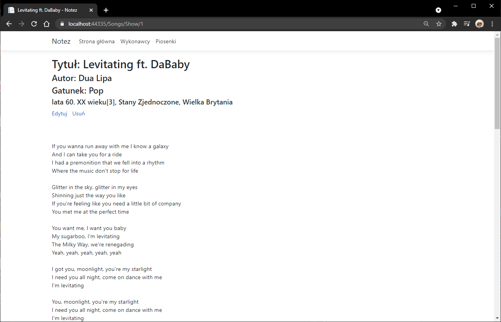
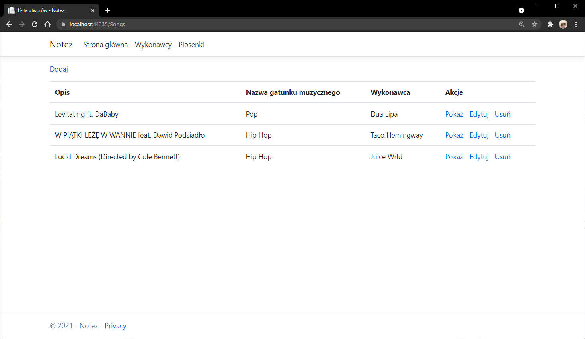
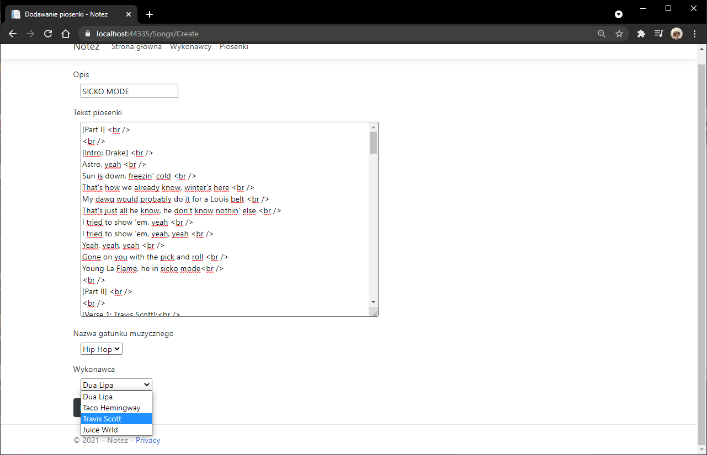

# GeniusRapCloneEntityFramework 

Genius Rap Clone - a website that allows users to display lyrics of their favourite songs. 
Website uses EntityFramework to handle a connection to the SQL database. 
User has the ability to add new artists and then to add/edit their songs. 
EntityFramework updates the database in real time. 
These is a SQL script included to the repository to generate a template database. 

## Kredek Lab5

This application was created as a homework for a university coding club [Kredek](https://www.facebook.com/KNKredek)

## Preview 

 

 
 

 

